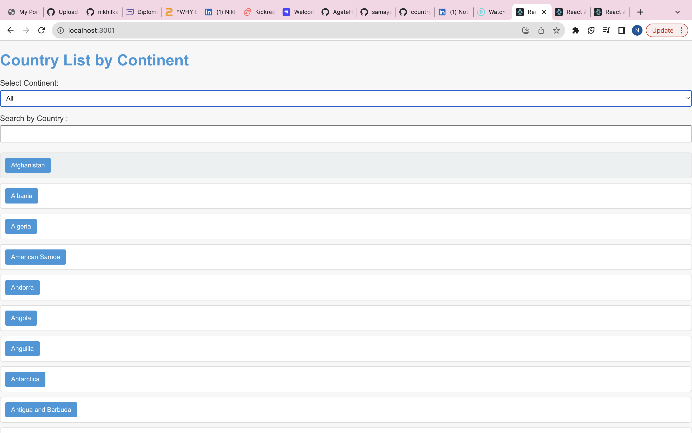
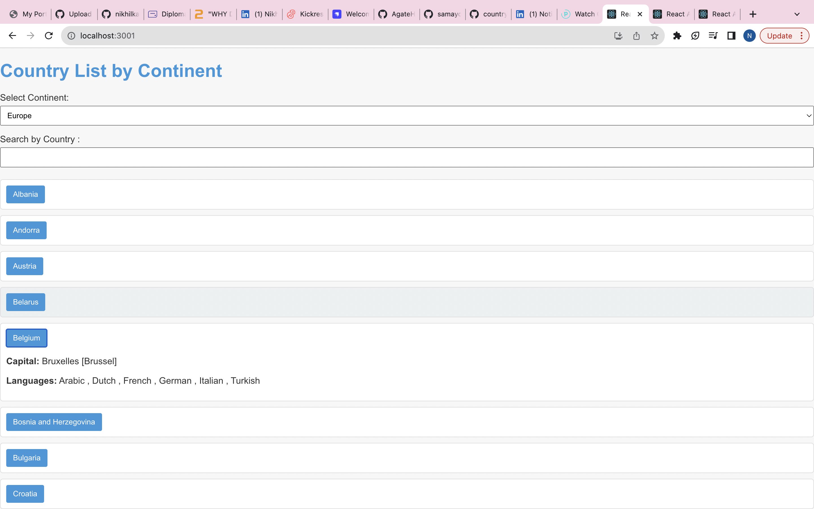
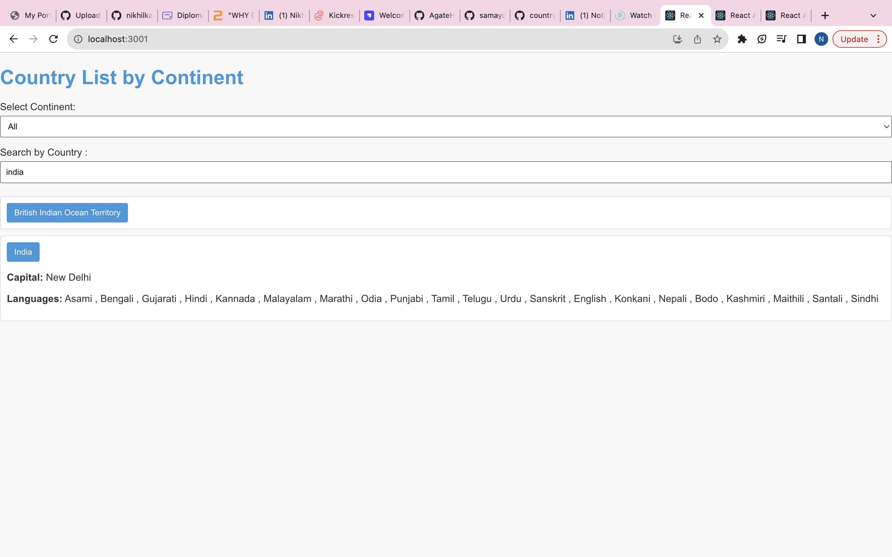

# front-end-countries-

I used $ npm install country-json from the https://github.com/samayo/country-json.
Please enter NPM start on the terminal to open the website,

I used react as the front end interface. Creating 2 files in the src folder - CountryList.js & styles.css

**Pictures below answering the questions provided**

Create a simple component that shows countries by continent on a single page
If you click, expand into a country you will see Capital, and languages spoken
Integrate a top search by country name

**Questions:**

How would you optimize the performance of the list rendering, in these 2 or 3 combined lists?

- If I have one large piece of data, I would use VirtualizedLists if im using React and put all the cataegories into different components such as "countries" "capital" "currency" etc

Can you explain the difference between state and props in React, and how would you use them for the search? 

- the main difference between the 2 is the way the props pass data from 1 component to antoher, whilst state the real-time data available to use within that only component. Data from props is read-only, and cannot be modified by a component that is receiving it from outside. State data can be modified by its own component, but it is private to external parties.

How does TypeScript enhance the development experience in a React application? 
- You can use typescript to reduce run time errors in your code,Early error detection and measier to maintain.

Extra points questions:

How would you handle pagination or infinite scrolling for a large list of countries? Assume only 10 per page are allowed.

- Both have advantages and disadvantages, and it depends on the website you are providing to try improve SEO. For a website showing countries and various information.

Can you explain how context API or Redux can be integrated into this project for state management? 

- I would use redux library because we as the developer can decide what information is shown to the user.

Thank you for reading

Nikhil Kalhan

